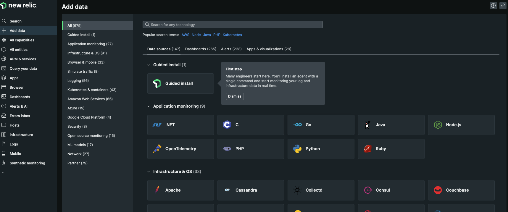
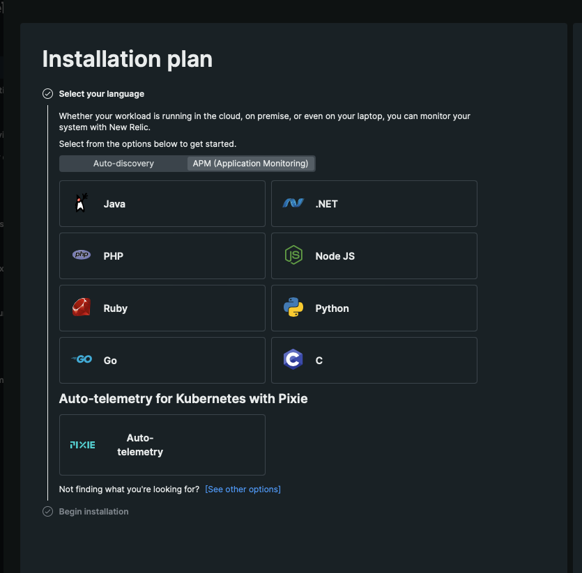

# Install New Relic for Go 

This repository showcases how to make a [Go app](https://github.com/CleverCloud/Go-example) that runs on [Clever Cloud](https://www.clever-cloud.com) observable using [New Relic](https://newrelic.com) Agent.

## How to

### Build on Clever Cloud

This project uses `gomod` to build. Add the following environment variable in Clever Cloud Console to deploy this app:

```shell
CC_GO_BUILD_TOOL="gomod"
```

### Connect to New Relic

The installation process is explained in [New Relic's doc for Go](https://docs.newrelic.com/docs/apm/agents/go-agent/installation/install-new-relic-go/) or can be done by following the step by step instructions provided by the Guided Install from your New Relic account.

Both processes are the same, except the Guided install will already contain your Licence Key in the code, which is convenient.

#### Guided Install from New Relic dashborad

From your New Relic home's account, go to the left menu options, click on **Add data >Guided Install**. 



Chose **APM (Application Monitoring)**, then select **Go**.



Follow the steps to import the agent into your Go application.

### Step 4: a note

The code in `main.go` contains the code in a new `init` block. You can also add it your `main` function. Both options are viable.

Don't forget to run `go run .` to compile and deploy before pushing your code.

🚀  **You don't need to complete step 7 when deploying on Clever Cloud**, as the runtime will read your code and get the agent automatically.
